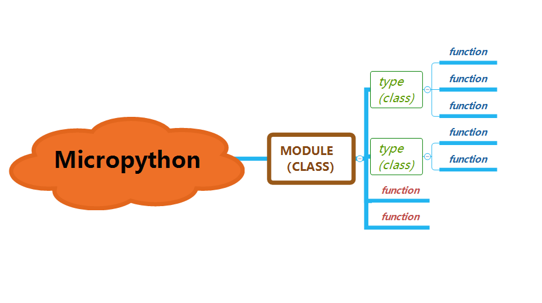
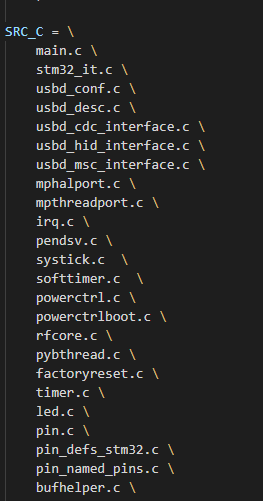
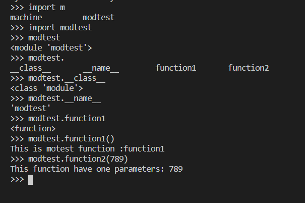

- [x]  已完成
- - [x]  ~~框架解读~~ 
- - [x] ~~固件编译~~ 
- - [x] ~~接口分析及添加~~ 
- [ ] 计划中
- - [ ] 已有驱动分析
- - [ ] 移植自定义驱动
- - [ ] 精简固件
- - [ ] 性能优化

# 一.框架
##  1.目录结构
        这个版本库的主要组件:
        - py/ --核心Python实现，包括编译器、运行时和核心库
        - mpy-cross/ --MicroPython 交叉编译器，用于将脚本变成预编译的字节码。
        - ports/unix/ --运行在 Unix 上的 MicroPython 版本。
        - - stm32/ --在PyBoard和STM32板上运行的MicroPython版本（使用ST的CubeHAL驱动程序）
        - - minimal/ -- 一个最小的MicroPython版本。如果你想把MicroPython移植到其他微控制器上，就从这个开始。
        - tests/ -- 测试框架和测试脚本。
        - docs/ -- 用户文档
        - extmod/ 一些不需要在 Core 中的抽象 C 接口代码
        - lib/ 给 port 用的各自平台的 SDK 依赖库，可能在里面，也可能在外面，并不重要
        - drivers/通过软实现的硬件驱动，基于 py 的架构使用标准 C 实现的 Python 模块（C + Python），和芯片自己提供的 SDK 略微不同，有较大的兼容性。
        附加组件:
        - ports/
        - - bare-arm/ -- 适用于 ARM MCU 的最低版本 MicroPython。主要用于控制代码大小.
        - - teensy/ -- 运行在 Teensy 3.1 上的 MicroPython 版本 (初始版本，但可以使用).
        - - pic16bit/ --  用于 16 位 PIC 微控制器的 MicroPython 版本.
        - - cc3200/ -- 运行在 TI CC3200 上的 MicroPython 版本.
        - - esp8266/ -- 运行在乐鑫的ESP8266 SoC上的MicroPython版本.
        - - esp32/ --运行在乐鑫的ESP32 SoC上的MicroPython版本.
        - - nrf/ --运行在Nordic的nRF51和nRF52 MCU上的MicroPython版本
        - extmod/ -- 用C语言实现的附加（非核心）模块.
        - tools/ -- 各种工具，包括pyboard.py模块.
        - examples/ -- 一些Python脚本示例.

## 2.tests文件夹
-     run-tests-exp.sh  run-tests-exp.py  run-tests  自动化的测试接口脚本，通过这样的方式可以让 micropython 解释器进行接口覆盖性测试。将在 repl 执行的 Python code 结果返回存到 .exp(example)下进行测试核对。

## 3.接口


&nbsp;&nbsp; &nbsp; &nbsp;  接口有3大类
+ module(class)  例如：machine
+ + type(class)  例如：machine.Pin machine.UART
+ + + function(function) 例如：machine.Pin.value


# 二.编译固件
## 1.编译环境
+ Linux (UbuntuServer 18.04 LTS)
+ GCC  ARM-GCC 编译链
+ + `apt-get install gcc`
+ + `apt-get install gcc-arm-none-eabi`
+ make 工具
+ + `apt-get install make`
## 2 编译Micropython自带的交叉编译器  
`make -C mpy-cross`
    ***mpy-cross在主目录下 ***
## 3 Build and Upgrade
+ 1.进入ports/stm32/  文件夹下  
+ 2.`make submodules`   获取子模块  
+ 3.`make BOARD=PYBV11 ` 为给定板编译  
+ 4.生成固件在`build-PYBV11/` 下  `firmware.dfu`
+ 5.使用Dfuse在winodws上升级 [下载链接](http://samedisk.com/cht/download.php?id=7)

# 三.添加C接口  module
## 1.ports/stm32 新建modtest.c，用户自定义模块主文件文件名自定
#### 1.1代码实现
```cpp
#include "stdio.h"
#include "py/obj.h"
#include "py/runtime.h"
#include "py/builtin.h"

//定义的modtest全局字典，之后我们添加type和function就要添加在这里
STATIC const mp_rom_map_elem_t modtest_globals_table[] = {
    {MP_ROM_QSTR(MP_QSTR___name__), MP_ROM_QSTR(MP_QSTR_modtest)},   //这个对应python层面的__name__ 属性
};
//这个可以认为是把modtest_globals_table注册到 mp_module_modtest.globals里面去
STATIC MP_DEFINE_CONST_DICT(mp_module_modtest_globals, modtest_globals_table);   

//这个是定义一个module类型
const mp_obj_module_t mp_module_modtest = {
    .base = {&mp_type_module},    
    .globals = (mp_obj_dict_t *)&mp_module_modtest_globals,
};

 ```
#### 1.2.模型解释
+  全局定义字典
```cpp
 mp_rom_map_elem_t modtest_globals_table[]    //定义的modtest全局字典，之后我们添加type和function就要添加在这里
 ```
+ 注册模块
```cpp
MP_DEFINE_CONST_DICT(mp_module_modtest_globals, modtest_globals_table) //这个可以认为是把modtest_globals_table注册到 mp_module_modtest.globals里面去
 ```
+ 定义module类型
```cpp
mp_obj_module_t mp_module_modtest //定义一个module类型
  ```
## 2.modules.c 添加到Makefile相应位置

## 3.module注册到micropython
&nbsp;&nbsp;&nbsp;&nbsp;&nbsp;&nbsp;我们要把我们定义的module注册到micropython中去，这个是在mpconfigport.h文件中修改
```cpp
extern const struct _mp_obj_module_t mp_module_machine;
extern const struct _mp_obj_module_t mp_module_network;
extern const struct _mp_obj_module_t mp_module_onewire;
extern const struct _mp_obj_module_t mp_module_modtest;    //这个是我们添加的，需要声明一下应用外部的struct

#define MICROPY_PORT_BUILTIN_MODULES \
    { MP_ROM_QSTR(MP_QSTR_umachine), MP_ROM_PTR(&machine_module) }, \
    { MP_ROM_QSTR(MP_QSTR_pyb), MP_ROM_PTR(&pyb_module) }, \
    STM_BUILTIN_MODULE \
    { MP_ROM_QSTR(MP_QSTR_uos), MP_ROM_PTR(&mp_module_uos) }, \
    { MP_ROM_QSTR(MP_QSTR_utime), MP_ROM_PTR(&mp_module_utime) }, \
    { MP_ROM_QSTR(MP_QSTR_modtest), MP_ROM_PTR(&mp_module_modtest) }, \ //这个是我们添加的modtest
    SOCKET_BUILTIN_MODULE \
    NETWORK_BUILTIN_MODULE \
    { MP_ROM_QSTR(MP_QSTR__onewire), MP_ROM_PTR(&mp_module_onewire) }, \
      
 ```
&nbsp;&nbsp;&nbsp;&nbsp;&nbsp;&nbsp;找到MICROPY_PORT_BUILTIN_MODULES 定义的地方按照格式添加我们定义的module
MP_QSTR_modtest这个名字要改成自定义的，MP_QSTR_这个一定要保留，后面的modtest就是在python中显示的module名字

# 三.添加C接口  给module添加function
&nbsp;&nbsp;&nbsp;&nbsp;&nbsp;&nbsp;在    [第二步-添加module](#二添加c接口--module)中已经添加好了一个模块，但是没有实现任何功能，这一节为module添加function实现功能。
&nbsp;&nbsp;&nbsp;&nbsp;&nbsp;&nbsp;函数是分为有参数和无参数的,一下两部分分别为有参数和无参数的添加方式
## 无参数函数
### 1.添加无参数的函数，我们给他起名为function1(这个名字是最终在python层面显示的)
```cpp
//这是我们定义函数
STATIC mp_obj_t modtest_function1()
{
    printf("This is motest function :function1\n");
    return mp_const_none;//不需要返回数据就返回它
}
//每一个我们和python接口的函数都需要使用这个宏定义
STATIC const MP_DEFINE_CONST_FUN_OBJ_0(modtest_obj_function1,modtest_function1);

STATIC const mp_rom_map_elem_t modtest_globals_table[] = {
    {MP_ROM_QSTR(MP_QSTR___name__), MP_ROM_QSTR(MP_QSTR_modtest)},
    {MP_ROM_QSTR(MP_QSTR_function1), MP_ROM_PTR(&modtest_obj_function1)},    //这条是我们添加的，把新建的函数注册进modtest里面去
};
 ```
&nbsp;&nbsp;&nbsp;&nbsp;&nbsp;&nbsp;所有我们和python对接的函数都要是返回mp_obj_t类型的 ，如果该函数实际不需要返回任何数据我们最后就调用return mp_const_none;

&nbsp;&nbsp;&nbsp;&nbsp;&nbsp;&nbsp;比较重要的一条就是这个了
```cpp
STATIC const MP_DEFINE_CONST_FUN_OBJ_0(modtest_obj_function1,modtest_function1);
```

micropython针对不同参数类型提供了好几个这种类似的宏定义。这里不深做解释，我们是用的`MP_DEFINE_CONST_FUN_OBJ_0`就是代表改函数是0个参数的。

&nbsp;&nbsp;&nbsp;&nbsp;&nbsp;&nbsp;最后一步就是把我们定义的function注册进`modtest_globals_table`中去，和前面注册module类型类似，`MP_QSTR_function1 `  该名称中的function1会作为我们在pythonfunction显示的名字。
&nbsp;&nbsp;&nbsp;&nbsp;&nbsp;&nbsp;python层我们调用 `modtest.function1()`就可以执行到我们函数中打印的内容
## 有参数函数
### 1.加一个带有一个参数的函数接口
```cpp
//参数类型要用mp_obj_t
STATIC mp_obj_t modtest_function2(mp_obj_t data)
{
    printf("This function have one parameters: %d\n",mp_obj_get_int(data));  //请注意这里从参数中提取整数使用的方法
    return mp_const_none;  //同样没有返回值
}
//这里使用的宏定义和面的名称不一样，OBJ_1区别
STATIC const MP_DEFINE_CONST_FUN_OBJ_1(modtest_obj_function2,modtest_function2);

STATIC const mp_rom_map_elem_t modtest_globals_table[] = {
    {MP_ROM_QSTR(MP_QSTR___name__), MP_ROM_QSTR(MP_QSTR_modtest)},
     //把新定义的函数注册进modtest_globals_table
};
 ```
&nbsp;&nbsp;&nbsp;&nbsp;&nbsp;&nbsp;定义的函数我们添加了一个`mp_obj_t `类型的参数，实际上`mp_obj_t `就是一个空指针，这样他可以用来传递任何类型，不管是整数，字符串都可以。具体是什么类型我们在函数内部用mp提供的对应的方法把他提取出来，比如这里认为传进来的是一个int型的，就是用`mp_obj_get_int(data)` 来提取出来整型。当然micopython还提供了很多其他类似的，需要注意一下是提取字符串的稍微形式上看起来有点区别：`mp_obj_str_get_str(arg) `。
&nbsp;&nbsp;&nbsp;&nbsp;&nbsp;&nbsp;关于`MP_DEFINE_CONST_FUN_OBJ_1`,官方给了7种接口,改最后的数字即可。

## 编译
[编译固件](#二.编译固件)

## 演示 

